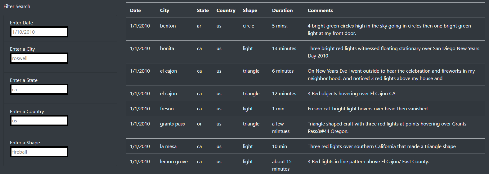
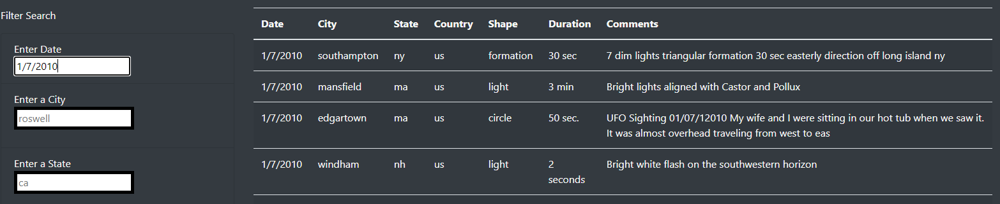
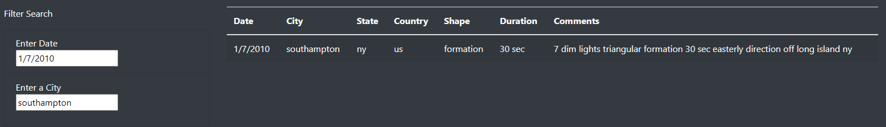
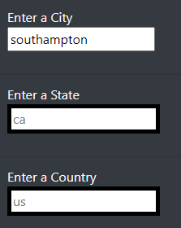
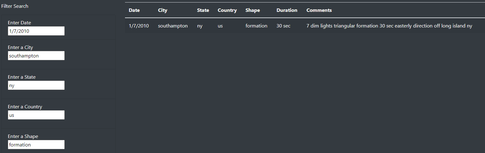

#
**UFOs**

# **Overview of Project:**

Welcome to the world of unexplained moving project roaming the sky, especially sightings of unusual crafts thought to be extraterrestrial. 
We retrieved a large dataset about UFOs sightings showcasing different metrics about them. (date, country, duration, comments, ...). 
We decided to create a webpage allowing users to easily interact with this information. 

Our problematic was, how could we enhance users experience to offer a more in depth analysis of UFOs sightings, helping them to narrow down their research on multiple criteria at the same time. 

# **Results:**
 
Utilisation of the webpage is straightforward and easy to use, UFOs sightings are display in a table and users can scroll down through all of them or filter it at their convenience. There is five filters available:

- Date.
- City.
- State.
- Country.
- Shape.
  

 
Then they can apply any filter to narrow down their search, start with a specific date, after a city and so on. 
We display below an example of an exploratory search, as well as a more specific search to showcase the capabilities of our web page. 

*Examples:*
 
Let start by searching all UFOs sightings for a specific date (January, 7th of 2010).
 

 
Only sightings from the entered date are now display in the table. If users want to be more specific (get a specific city from this date), he can apply more filter.
 

 
The way the webpage is build, allow users to see which filter are still available by highlighting the border of the search placeholder.
 

 
If a user is already aware of all characteristics on a sightings, he can just input as much information as he knows and get the specific result on the table.
 

# **Summary:**

Our webpage is interactive, it could be use in an exploratory mode or with clear search parameters in mind. 
Users could use different criteria on a fully dynamic webpage who react to end users input and allowed them to apply filters to specify their search. They could make one selection and see the update results, then look through the results and get an idea for another filter to apply. 

<u>Disadvantages:</u>

Some drawbacks could be pinpoint here:
 - Filter might be too specific and attended to a more knowledgeable public about UFOs and possibly be confusing for a casual user interacting with the webpage. 
 - All code to create and use the webpage is store locally, to allow access to one and all it  will need to be hosted on an opensource system. 
   *Examples:*
   - GoogleAppEngine. 
   - GitHub.

<u>Recommendations:</u>

As it is, the webpage while working powerfully and allowing users to filter they search, some improvements can be added: 

- This site only interact with the data we input when creating it. Setting up a data pipeline (web-scraping for example) to feed it could offer our users up-to-date and a wider range of information on UFOs sightings:
 
    *Examples:*
  - More countries to filter from.
  - A wider time range.
  - More cities.
 
- As more data will be incorporated, we should optimize our page speed to ensure an interrupting experience for the user and improve the load time of the webpage. 
- We could also add a button underneath the Filter Search to allow users to refresh all entered filters by a click instead of having to manually erase their input.

